# Vishal Tyagi

<picture>
  <source media="(prefers-color-scheme: dark)" srcset="./dark.svg">
  <source media="(prefers-color-scheme: light)" srcset="./light.svg">
  
</picture>

## About

Full Stack Developer focused on building modern web applications with the MERN stack and Java.

- B.Tech CSE student at RKGIT / AKTU
- Building full-stack applications with React, Node.js, Express and MongoDB
- Practicing Java and Data Structures & Algorithms
- Interested in practical software engineering, AI-assisted applications and developer tooling

## Engineering Stack

**Languages**  
`Java` `JavaScript` `HTML5` `CSS3`

**Frontend**  
`React` `Tailwind CSS` `Material UI` `Context API` `React Router`

**Backend**  
`Node.js` `Express.js` `REST APIs` `Socket.IO`

**Database & Auth**  
`MongoDB` `Mongoose` `JWT`

**Tools & Deployment**  
`Git` `GitHub` `VS Code` `Vercel` `Render`

**Testing**  
`Software Testing` `QA` `Functional Testing` `Regression Testing`

## Featured Projects

### HireMate — AI Interview & Placement Preparation Platform

A full-stack interview-preparation platform with resume analysis, mock interviews, coding interviews and skill-gap analysis.

### MERN Blog Platform

A full-stack blogging platform with posts, comments, profiles, authentication and image handling.

[Live Project](https://mern-blog-platform-hisp-cyan.vercel.app/)

### ChatNow — Real-Time Chat Application

A real-time communication application built with Node.js, Express, MongoDB and Socket.IO.

[Live Project](https://chatnow-0stp.onrender.com/)

### SATYA — Smart Automated Tender & Eligibility Analysis

An AI-assisted GeM tender-analysis project focused on bid compliance and eligibility analysis.

## Experience & Learning

- Web Development training with Netcamp Solutions
- Software testing / QA internship and training experience
- Java, DSA and MERN development practice
- Prompt Relay participation and software-engineering learning tracks

## Connect

- GitHub: [@visty-exe](https://github.com/visty-exe)
- LinkedIn: [@visty](https://www.linkedin.com/in/visty/)

---

  Building. Learning. Shipping.

